# Kapiree Implementation Flow Diagrams

## Overview
This document contains interactive flow diagrams for the Kapiree pricing and cart implementation, showing user journeys, technical architecture, and implementation phases.

## 1. User Journey Flow

### Primary User Flow
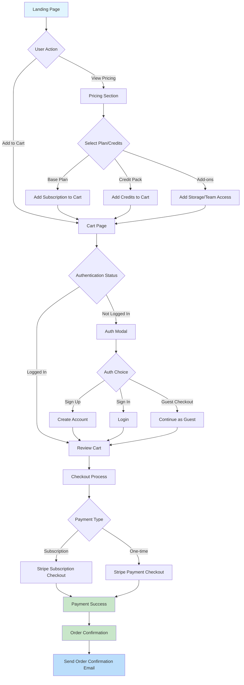

### Authentication Flow
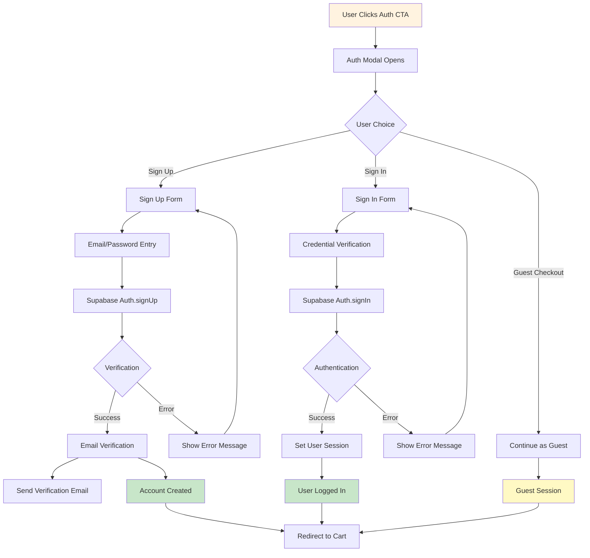

## 2. Technical Architecture Flow

### System Architecture
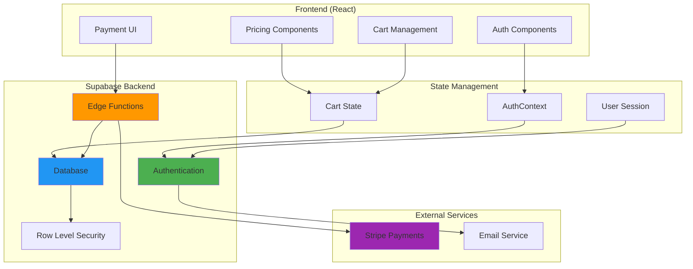

### Email Content Management
Email content for all user notifications is managed in `server/emails/email_templates.js`. This file exports functions that generate the HTML/text content for each specific email type, allowing for easy customization and localization.

### Database Schema Flow
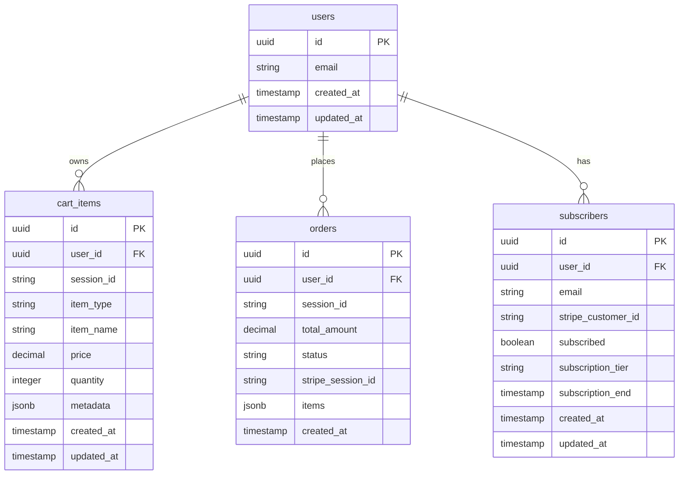

## 3. Implementation Phases Flow

### Development Timeline
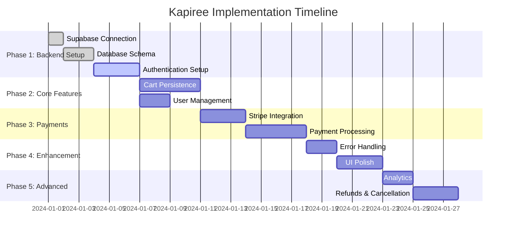

### Feature Dependencies
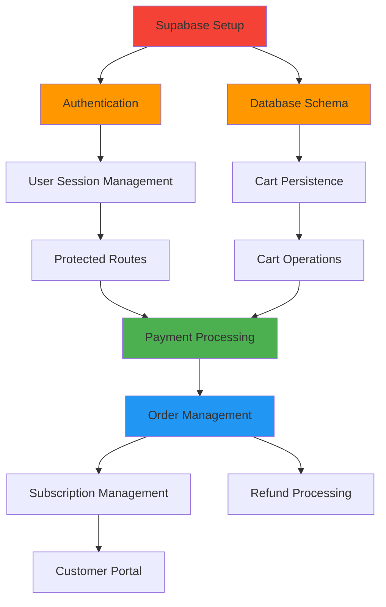

## 4. Payment Processing Flow

### Stripe Integration Flow
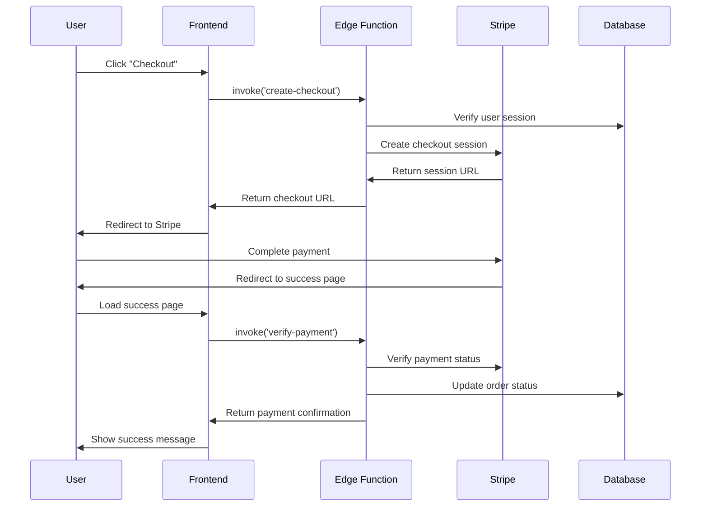

### Subscription Management Flow
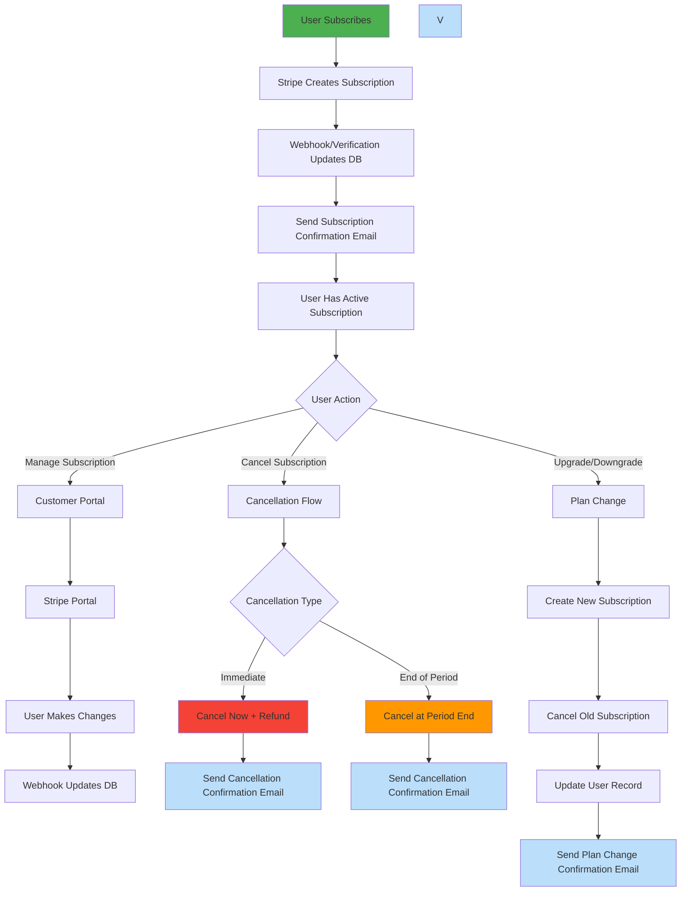

## 5. Error Handling & Recovery Flow

### Error Scenarios
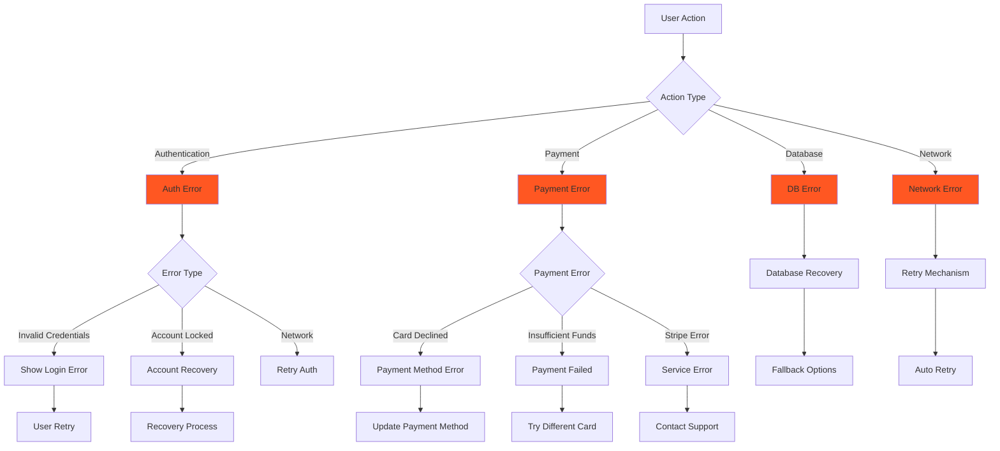

## 6. Data Flow Diagrams

### Cart State Management
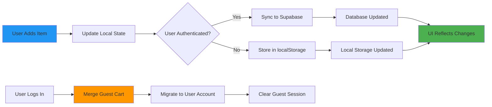

### Authentication State Flow
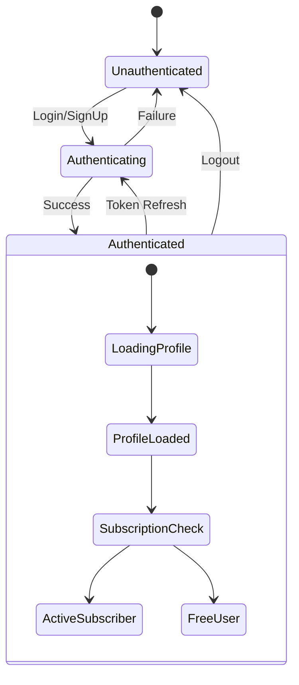

## 7. Performance & Optimization Flow

### Caching Strategy
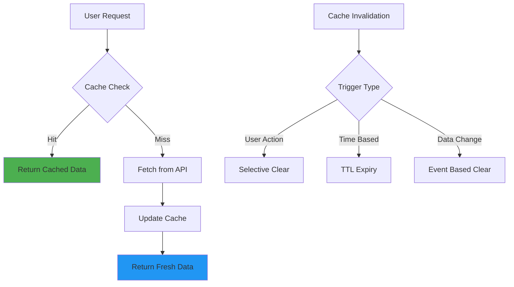

## Usage Instructions

1. **Implementation Planning**: Use the gantt chart and dependency flows to plan development phases
2. **User Experience Design**: Reference user journey flows for UX decisions
3. **Technical Architecture**: Use system diagrams for infrastructure planning
4. **Error Handling**: Follow error flow diagrams for robust error management
5. **Performance**: Implement caching strategies based on optimization flows

## Interactive Features

These diagrams can be enhanced with interactive React Flow components for:
- Clickable nodes leading to detailed documentation
- Real-time status updates during implementation
- Interactive tutorials for team onboarding
- Visual progress tracking

---

*This document serves as a visual companion to the main implementation specification and should be updated as the project evolves.*
